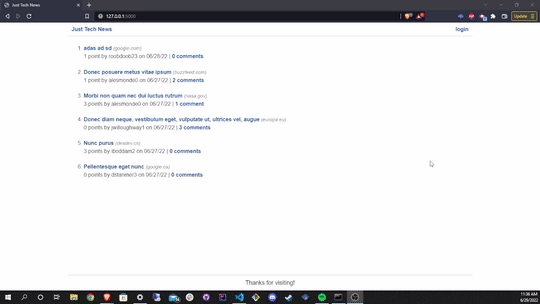

# python-newsfeed

## Table of Contents
* [Description](#Description)
* [Installation](#Installation)
* [Usage](#Usage)
* [Questions](#Questions)
* [Credits](#Credits)

## Description
Python Newsfeed is a social media application built as an implementation of a Python API. Users can create an account or login, create/edit/delete a post, and comment on/like the posts of other users. The API was built using Python, MySQL, PyMySQL, SQLAlchemy (ORM), bcrypt (password hashing), Flask, and gunicorn. It was implemented into the frontend using Jinja for templating.

## Usage
Here is a demonstration of how to use this app:

        

## Installation
No installation is required to use this application. Simply access via the deployed Heroku URL: https://python-tech-news-hilberling.herokuapp.com/

## Questions
If you have any questions about this project, please contact me via my GitHub: https://github.com/garretthilberling

## Credits
This project was created solely by Garrett Hilberling: https://www.linkedin.com/in/garretthilberling/
